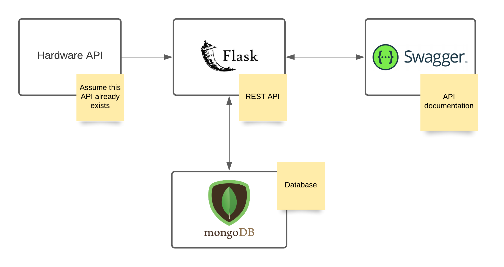

# Meeting minute - 18/11/2021

## Data that we need to collect

We are assuming the existence of the following data:

#### Offline data:
  - Manifest (known 24h prior) (collecting and restoring pieces)
    - List of objects, quantities and positions
  - Warehouse stock
  - Location of each sensor
  - Employees that have access to the warehouse (to collect or restore stock)

#### Online data:
  - Sensor's data
    - Battery
    - Movement on each sensor (when someone takes a piece)
  - Cart position
  - Operator that is in the warehouse at the moment

## Manifest Assumptions:
- Timestamp
- Staff Id (collection only)
- Pieces
  - id
  - location / position
  - quantity

## MVP Definition:
- Assume that we have access to an API to get the raw data
- Retrieve the necessary data using that API and save it to a MongoDB database.
- Develop an API, using Python Flask, where the other groups can retrieve the necessary processed data (we are going to use Python because we need to process the data with Pandas)

## Architecture:

## MVP API Endpoints:
- `layouts/timestamp=...` (Can filter by date; Default is to return array with all the layouts until now)
- `staff/name=...&age=...` (Returns available data of all employees; can filter by name, age, etc.)
  - `/id` (Returns employee data with the specified id)
- `stock/{id}?timestart=...&timeend=...` (Pieces stock on a determined time; can specify piece id)
- `sensors/` (Returns the position and the corresponding types of pieces of all the sensors; we are assuming a sensor can be responsible for more than one piece)
  - `/id/?timestart=...&timeend=...` (Returns the position, the battery level, the number of registered movements in the corresponding time interval, and the pieces which the sensor with id `id` id responsible)
    - `/movements/?timestart=...&timeend=...` (Returns the movements of a specific sensor on a determined time interval)
- `manifests/`
  - `collect?timestart=...&timeend=...&staff_id=...` (Returns data about every "collect" manifest on a determined time interval; can filter also by employee id)
  - `/reposition?timestart=...&timeend=...` (Returns data about every "reposition" manifest on a determined time interval)
- `cart/?timestart=...&timeend=...` (Returns the cart position on a determined time interval)

### After MVP:
- Processing of collected data
  - Dealing with missing values
  - Dealing with outliers
- Statistics about the collected data
  - Time taken by an employee to complete a manifest
    - Employees with longest completion time
  - Amount of mistakenly fetched/missing pieces by an employee
    - Employees with most errors
  - Time between collecting two different pieces (knowing timestamp of the movement sensors) (determining what pieces take longer or shorter to fetch)
  - Estimating duration (in days) of a sensor's battery (knowing the battery usage of a sensor in one or more days)
    - Estimating the battery usage when sending a message/battery usage of a LED and using those values to calculate
  - Time to restore the stock
  