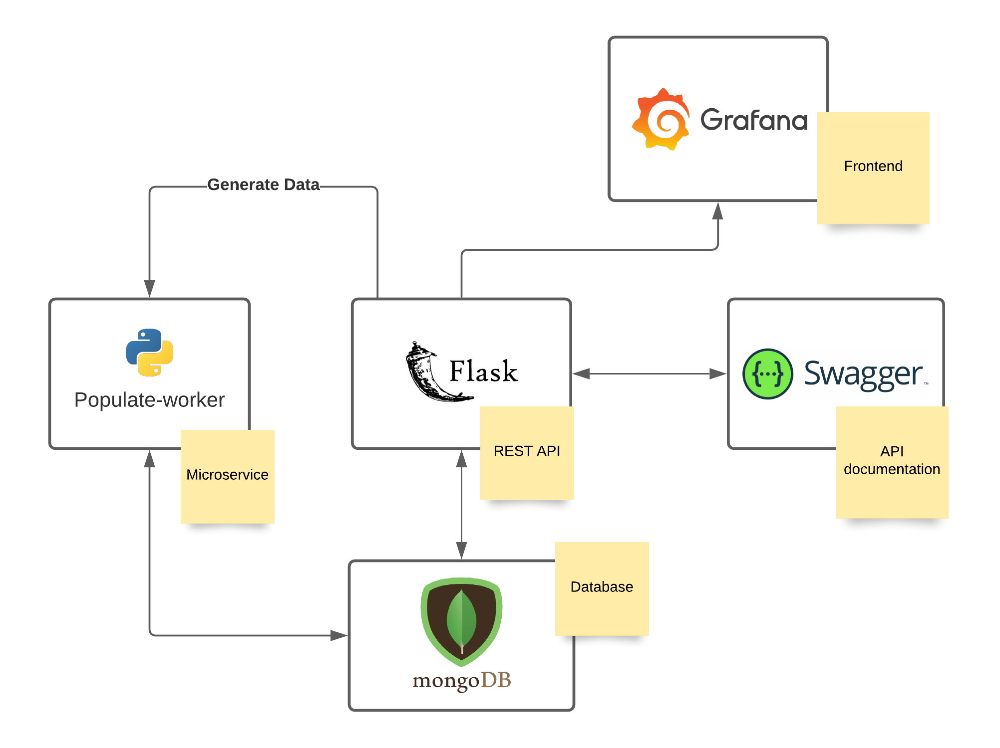

# Architecture

The following diagram illustrates our vertical's architecture.

Note that the populate-worker microservice aims to populate the database with online and offline data. Periodically, it makes HTTP requests to the generate_data endpoint of our Flask API, which generates data to simulate the warehouse. Then, it populates the database with that generated data.

Tools used:

-   Docker: The entire project will be built around Docker. It uses OS-level virtualization to deliver software containers isolated from one another and bundle their software.

-   Flask: Microweb framework written in Python. It is used to build a REST API demonstrated in the picture above.

-   Python: Used in Flask and the populate-worker microservice.

-   Swagger: Interface Description Language for describing RESTful APIs. It is used to document the API developed with Flask.

-   MongoDB: Document-oriented database which will be responsible for storing the data.

-   Grafana: Multi-platform open-source analytics and interactive visualization web application. It is used to display all the data present in our database.
