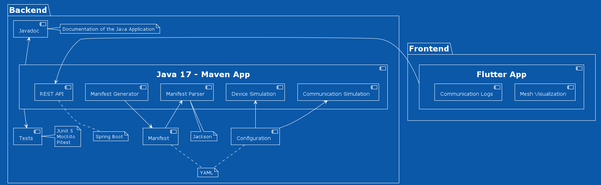

# Architecture

This vertical's architecture is defined in the following component diagram:

## Tools used

- [Docker](https://www.docker.com/): Open source containerization platform. Will
  be used to package all the software into containers. Allows for better
  compatibility since the code executes in containers isolated from the OS.
- [Docker compose](https://docs.docker.com/compose/): Link multiple containers.

### Backend

- [OpenJDK 17](https://openjdk.java.net/projects/jdk/17/): The software for the
  simulation of devices' communication and behaviour will be developed using
  Java 17.
- [Maven 4](https://maven.apache.org/): To build and manage our Java project
  more easily, we will be using the Maven build automation tool. This tool
  allows for better dependency handling and is supported in the most popular
  IDEs. Many maven plugins are used for packaging the application (see pom.xml
  file for details).
- [Javadoc](https://www.oracle.com/java/technologies/javase/javadoc-tool.html):
  API documentation generator for the Java source code.
- [Jackson](https://github.com/FasterXML/jackson): Java-based library that will
  be used to parse and manipulate YAML configuration files.
- [Spring Boot](https://spring.io/projects/spring-boot): Framework built on top
  of the spring framework, used for building web applications and microservices.
  Will be used to develop the REST API for frontend communication with backend.
- [JUnit 5](https://junit.org/junit5/): The 5th major version of the
  programmer-friendly testing framework for Java and the JVM.
- [Pitest](http://pitest.org/): PIT is a state of the art mutation testing
  system, providing gold standard test coverage for Java and the jvm. It's fast,
  scalable and integrates with modern test and build tooling.

### Frontend

- [Flutter 2](https://flutter.dev/): Cross-platform UI toolkit. Used for
  development of the graphical user interface to visualize the mesh
  communication.
- [GraphView](https://github.com/nabil6391/graphview): Flutter GraphView is used
  to display data in graph structures. It can display Tree layout, Directed and
  Layered graph. Useful for Family Tree, Hierarchy View.
- [Flutter gherkin](https://github.com/jonsamwell/flutter_gherkin): Acceptance
  tests in gherkin.
- [Chrome driver](https://chromedriver.chromium.org/downloads): Platform to run
  the acceptance tests on.
- [Integration test](https://docs.flutter.dev/testing/integration-tests): For
  frontend accpetance tests.
