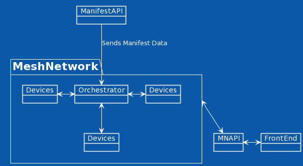
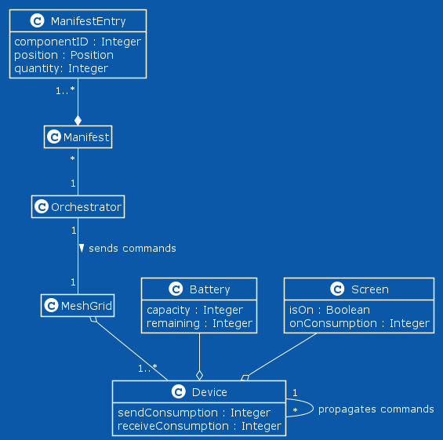

# Specification

## Description

The purpose of this vertical is to develop an application for simulating the behaviour of the devices used in the warehouse. Using this application, it is possible to generate warehouse manifests and simulate the devices' actions and communication, allowing for a simple visualization of the device mesh grid and custom configurations (such as failure rate of the devices and communication, battery capacities and energy consumptions).

## UML Class Diagram

## MVP 

- Simple command line program to simulate the devices grid: 
  -  Input: 	
    - Devices battery
    - Devices usage
  -  Generate random manifests
- Show a 2D representation of the route and how the devices interact
- Main focus is the mesh device communication
- Manifest contains a list of objects, their quantity and position
  - We will assume the most simple route as the layout optimization is not our objective
  - Simulate routes for every employee
  - Every object is a node

## Layout File

A file should be received containing the warehouse's layout, where the items will be placed.

## Configuration File

The configuration file should contain:

- The time taken for the employee to get an object
- The speed at which the employee moves
- The seed used on random (to control randomness if needed)
- The probability a message is lost
- The probability of device failure
- Device max battery
  - Idle battery consumption
  - Screen battery consumption
  - Sending/Receiving messages battery consumption
- The probability of the user picking up the wrong item
- Screen display policy:
  - On until the item is taken
  - On until the end of the route
  - On until the next item is reached
  - On while items are on the same shelf
- Time taken to perform maintenance

## Documentation

- Use JavaDoc to document the code
- It is not necessary to document every function, however, each class should have a brief description associated
  - It is important to document code blocks that are more complex or less intuitive
- The documentation should be done at the time its respective user story is closed
- The wiki should contain the documentation for more complex or less intuitive code

