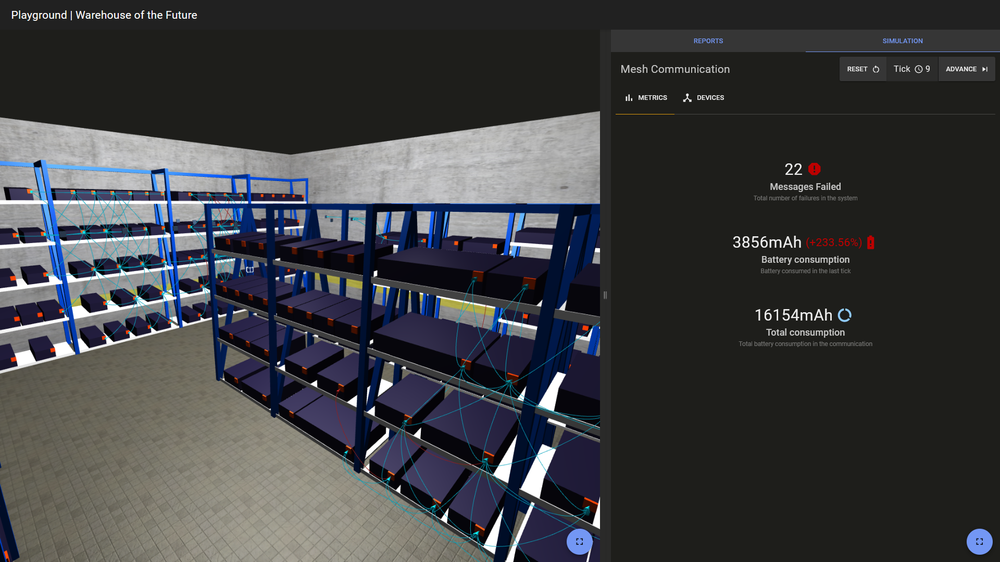

# Warehouse of the Future | Playground

Playground is a web application focused on providing maintenance staff a tool to visualize the real-time status of the warehouse.

## The team

- [Tiago Silva](https://github.com/tiagodusilva) \[Product Owner\] - up201806516
- [Ricardo Fontão](https://github.com/rfontao) \[Scrum Master\] - up201806317
- [Eduardo Correia](https://github.com/Educorreia932) - up201806433
- [Ivo Saavedra](https://github.com/ivSaav) - up201707093
- [João Cardoso](https://github.com/joaoalc) - up201806531
- [Telmo Baptista](https://github.com/Telmooo) - up201806554

## Specification

Product specification can be read in detail [here](docs/specification.md)

## Changelog

Changelog can be read fully at [CHANGELOG.md](CHANGELOG.md)

## How to run

First create a `.env` file equal to `.env.example` and change its values appropriately.

You can deploy the web application using Docker by running `docker-compose up`.

To delete all volumes from Docker run `docker-compose down -v`.

To populate the database, run `docker exec playground_backend yarn seed`.

## How to use

After running the program, the following should appear:

### Warehouse visualization - Left Panel

3D representation of the warehouse. Buckets represent the items and their devices. Arrows between devices represent devices communicating with each other.

### Reports and Metrics - Right Panel

Reports tab - Includes reports about issues related to the devices

Simulation tab - Displays the communication between devices over time

#### Allowed actions

- Reset simulation
- Advance one tick
- Add action to report

#### Metrics tab

- Displays metrics about the devices:
  - Number of failed devices  
  - Battery consumption (last tick and total)

## Testing

### Backend

The backend is tested with Unit-tests using the framework [Pytest](docs.pytest.org). To run them, inside the `backend` directory, run `yarn test`.

### Frontend

The frontend is tested with integration tests using the framework [Cucumber.js](https://cucumber.io/docs/installation/javascript/). To run them, inside the `frontend` directory, run `yarn test`.
