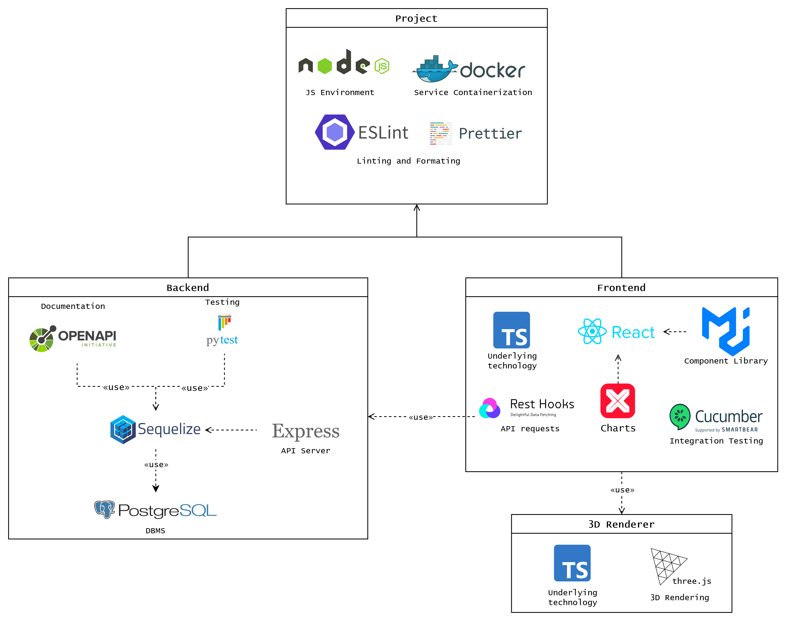

# Playground - Team 3

Playground is a web-app focused on providing maintenance staff a tool to visualize the real-time status of the warehouse. It also allows the user to simulate a specific warehouse layout.

## Features

- 3D representation of the warehouse layout
- 3D device communication representation
- Device simulation and statistics
- List of reports/issues from the factory (e.g.: Device failures)
- Add actions to reports

## Similar Products

In order to understand the feasibility of our product, we searched for similar products on the web.

One crutial example would be [Critical Manufacturing MES](https://www.criticalmanufacturing.com/mes-for-industry-4-0/) product.

It provides a digital twin of a factory, alongside dashboards with live charts and control panels.

However, that product is very generalized and has a much broader scope than what we need.

## API

The API documentation can found [here](openapi.yaml).

## Technologies used

The application architecture is explained by the following diagram: 
 

### Frontend

- [React](https://reactjs.org/)
- [Typescript](https://www.typescriptlang.org/)
- [visx](https://airbnb.io/visx/)

### Rendering (Warehouse)

- [Three.js](https://threejs.org/)
- [Typescript](https://www.typescriptlang.org/)

### Database (Reports, actions)

- [PostgreSQL](https://www.postgresql.org/)

### Backend

- [Express](https://expressjs.com/)
- [Sequelize](https://sequelize.org/v6/)

### Unit Testing

- [Python](https://www.python.org/)
- [Pytest](docs.pytest.org)

### Integration Testing

- [Selenium](https://www.selenium.dev/)
- [Cucumber](https://cucumber.io/)

### Documentation

- [OpenAPI](https://www.openapis.org/)

### Deployment

- [Docker](https://www.docker.com/)
